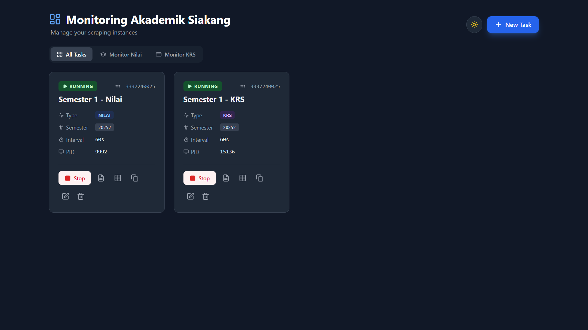

# Monitoring Akademik Siakang

<br>

<div align="center">
   
</div>

<br>

Aplikasi monitoring akademik **Siakang Untirta** berbasis web yang robust dan modern. Pantau aktivitas akademik secara real-time dengan notifikasi multi-channel ke **Telegram** & **WhatsApp** melalui dashboard interaktif.

## Fitur Utama

- **Dual Monitoring Mode**:
  - **Monitor Nilai**: Pantau nilai baru, perubahan nilai, IP, dan IPK.
  - **Monitor KRS**: Pantau ketersediaan Matkul incaran saat masa KRS (Livewire Support).

## Fitur Pendukung

- **Web Dashboard Modern**: Antarmuka Vue.js responsif dengan Dark Mode.
- **Multi-Channel Notification**: Mendukung **Telegram Bot** dan **WhatsApp** (via WAHA) untuk notifikasi instan.
- **Multi-Account & Group Support**: Pantau banyak akun sekaligus. Notifikasi WA bisa dikirim ke **Grup WhatsApp**.
- **Smart Reordering**: Atur urutan prioritas monitoring dengan drag & drop yang cerdas per kategori.
- **One-Click Clone**: Duplikasi konfigurasi task untuk setup cepat.
- **Visual Data Viewer**:
  - **Nilai**: Lihat transkrip sementara, Mutu, SKS di tabel rapi.
  - **KRS**: Indikator warna (Hijau/Merah) untuk status matkul target (Found/Missing).
- **Full Control**: Start/Stop monitoring, lihat Live Logs, hapus Logs, dan Reset Data scraping langsung dari UI.
- **Docker Ready**: Deployment mudah dengan isolasi environment penuh.

## Cara Install & Penggunaan

### Opsi 1: Menggunakan Docker (Recommended)

**Clone Repository**

```bash
git clone https://github.com/mohfer/monitoring-akademik-siakang
cd monitoring-akademik-siakang
```

**Setup Environment Variable**

Salin `.env.example` ke `.env`:

```bash
cp .env.example .env
```

Isi konfigurasi di dalamnya:

- `TELEGRAM_TOKEN`: Token bot Telegram Anda (optional).
- `WAHA_BASE_URL`: URL server WAHA (optional, untuk WhatsApp). **WAHA adalah service eksternal** yang perlu di-setup terpisah. Lihat [dokumentasi WAHA](https://waha.devlike.pro/) untuk instalasi.
- `WAHA_SESSION`: Nama session WAHA (default: `default`).
- `WAHA_API_KEY`: API Key WAHA jika server Anda menggunakan autentikasi.

**Note**: Minimal isi salah satu dari `TELEGRAM_TOKEN` atau `WAHA_BASE_URL` untuk menerima notifikasi.

**Jalankan Aplikasi**

```bash
docker-compose up -d --build
```

Akses dashboard di: `http://localhost:3000`

### Opsi 2: Instalasi Manual (Developer)

**Prerequisites:** Python 3.10+, Node.js 18+

**Setup Backend**

Salin `.env.example` ke `.env` dan konfigurasikan.

```bash
cp .env.example .env
python -m venv .venv
# Activate venv (Windows: .venv\Scripts\activate | Linux: source .venv/bin/activate)
pip install -r requirements.txt
python -m uvicorn server.main:app --reload --port 8000
```

**Setup Frontend**

```bash
cd frontend
npm install
npm run dev
```

## Panduan Penggunaan

### Membuat Monitor Baru

1. Klik **"+ New Task"**.
2. Pilih Tipe: **Nilai (Grades)** atau **KRS (Plans)**.
3. Masukkan **Login ID** (NIM) & **Password** Siakang.
4. **Notifikasi**:
   - Isi **Telegram Chat ID** untuk notifikasi ke Telegram Personal.
   - Isi **WhatsApp Number** (misal: `62812xxx`) atau **Group ID** (misal: `123...@g.us`) untuk notifikasi WA.
   - _Tips: Cek **Group ID** di [Dokumentasi WAHA](https://waha.devlike.pro/swagger/#/%F0%9F%91%A5%20Groups/GroupsController_getGroups)._
5. **Konfigurasi Khusus**:
   - **Mode Nilai**: Klik "Fetch" Semester dan pilih semester aktif.
   - **Mode KRS**: Masukkan nama-nama matkul target (satu per baris) di kolom "Target Courses".
6. Simpan & Klik **Start**.

### Fitur Lain

- **Clear Logs**: Klik ikon tempat sampah di modal Logs untuk membersihkan log lama.
- **Reset Data**: Klik ikon reset di modal Data untuk menghapus cache hasil scraping agar notifikasi bisa muncul lagi saat data baru masuk.

## Disclaimer

Aplikasi ini menggunakan metode _web scraping_. Perubahan pada website Siakang Untirta dapat mempengaruhi fungsionalitas. Gunakan interval waktu yang wajar (default 300s) agar tidak membebani server kampus.
