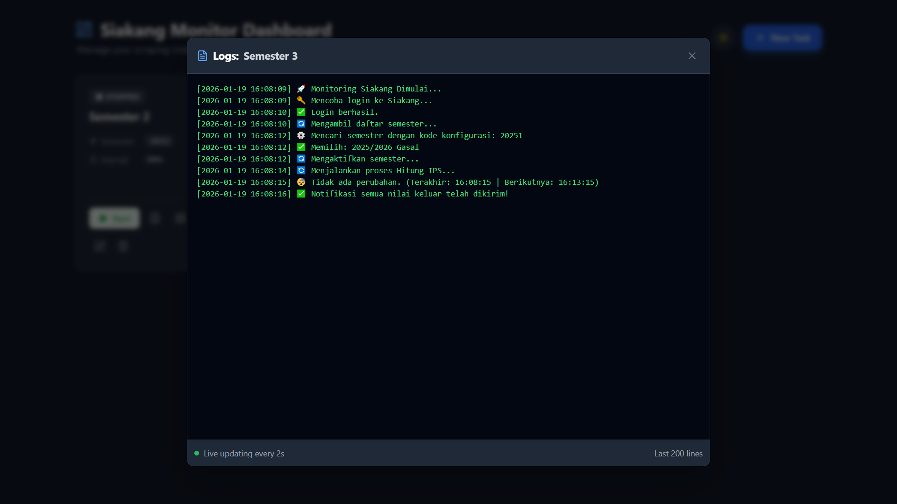
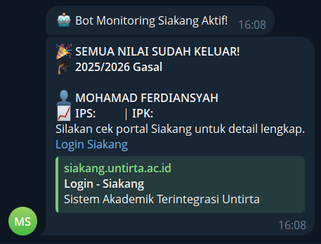

# Monitoring Nilai Siakang

Script Python sederhana untuk memantau perubahan nilai pada portal akademik **Siakang Untirta**. Script ini secara berkala mengecek halaman hasil studi dan mengirimkan notifikasi ke Telegram jika ada nilai baru yang keluar atau terjadi perubahan nilai.

## Tujuan

Memudahkan mahasiswa untuk mengetahui update nilai ujian/semester tanpa harus login dan me-refresh halaman Siakang secara manual berulang kali.

## Fitur Utama

- 🔄 **Monitoring Berkala**: Otomatis mengecek nilai setiap selang waktu tertentu (default: 5 menit).
- � **Pilih Semester**: Memungkinkan pengguna memilih semester spesifik yang ingin dipantau (Ganjil/Genap/Antara) saat awal script dijalankan.
- 🔐 **Auto Relogin**: Menangani sesi login yang kadaluarsa secara otomatis dan tetap mempertahankan semester yang dipilih.
- 📱 **Notifikasi Telegram**: Mengirim pesan detail (Mata Kuliah, Nilai, Mutu) langsung ke Telegram saat ada perubahan.
- 💾 **Penyimpanan Lokal**: Menyimpan data terakhir (`last_values.json`) untuk mendeteksi perubahan.
- 🧹 **Pembersihan Data**: Membersihkan elemen HTML (badge baru/ulang) agar data yang diambil bersih.

## Screenshot Output






## Prasyarat

- Python 3.8+
- Akun Siakang (NIM & Password)
- Bot Telegram (Token & Chat ID)

## Cara Install & Penggunaan

1. **Clone Repository (atau download script)**

   ```bash
   git clone https://github.com/mohfer/monitoring-nilai-siakang
   cd monitoring-nilai-siakang
   ```

2. **Buat Virtual Environment (Opsional tapi disarankan)**

   ```bash
   python -m venv .venv
   # Windows
   .venv\Scripts\activate
   # Linux/Mac
   source .venv/bin/activate
   ```

3. **Install Dependencies**

   ```bash
   pip install -r requirements.txt
   ```

4. **Konfigurasi Environment**
   Salin file `.env.example` menjadi `.env` dan isi data Anda:

   ```bash
   cp .env.example .env
   ```

   Edit file `.env`:

   - `LOGIN_ID`: Email/NIM login Siakang.
   - `PASSWORD`: Password Siakang.
   - `TELEGRAM_TOKEN`: Token bot dari @BotFather.
   - `CHAT_ID`: ID chat tujuan notifikasi (bisa dicek lewat bot userinfobot).
   - `TARGET_SEMESTER_CODE` (Opsional): Isi kode semester (misal: `20251`) untuk bypass pemilihan menu (wajib jika pakai PM2/Background Service).

5. **Jalankan Script**
   ```bash
   python main.py
   ```

## Struktur File

- `main.py`: Kode utama program.
- `last_values.json`: File database lokal (dibuat otomatis).
- `.env`: File konfigurasi rahasia.

## Catatan

- Script ini menggunakan _web scraping_. Perubahan tampilan pada website Siakang mungkin dapat menyebabkan script gagal mengambil data.
- Gunakan interval waktu yang wajar (jangan terlalu cepat) agar tidak membebani server kampus.
