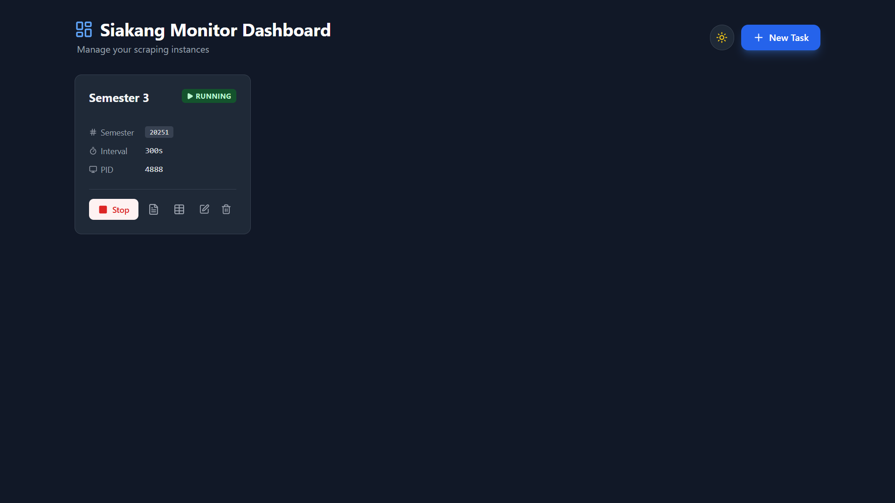
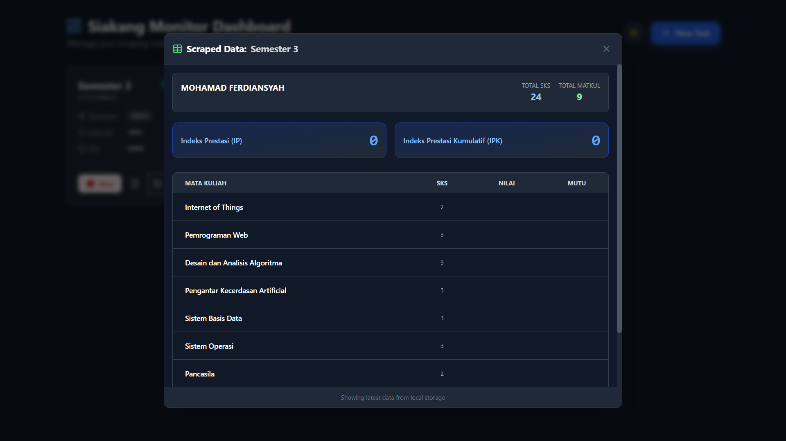

# Monitoring Nilai Siakang

Aplikasi monitoring nilai akademik **Siakang Untirta** berbasis web yang robust dan modern. Memungkinkan Anda memantau nilai dari **banyak akun mahasiswa sekaligus** (Multi-account), mendapatkan notifikasi Real-time via Telegram, dan melihat riwayat nilai dalam Dashboard yang interaktif.

## ✨ Fitur Utama

- 🖥️ **Web Dashboard Modern**: Antarmuka Vue.js responsif dengan Dark Mode.
- 👥 **Multi-Account Manager**: Pantau nilai untuk banyak akun (NIM) secara bersamaan dalam satu server.
- �️ **Drag & Drop Reorder**: Atur urutan prioritas pemantauan dengan mudah.
- 📋 **One-Click Clone**: Duplikasi konfigurasi task (NIM/Password) untuk membuat task baru lebih cepat.
- �📱 **Notifikasi Telegram**: Pesan otomatis saat nilai keluar (Nilai Angka, Mutu, dan Perubahan IP/IPK).
- 📊 **Data Viewer**: Lihat detail transkrip sementara, IP, IPK, dan Total SKS langsung di dashboard.
- 🔍 **Semester Auto-Fetch**: Otomatis mendeteksi dan memilih semester aktif dari akun Siakang.
- ⚡ **Manual Data Fetch**: Update data nilai secara instan tanpa perlu menjalankan proses monitoring terus-menerus.
- 🛠️ **Process Management**: Start/Stop monitoring per-akun dan lihat logs realtime.
- 🐳 **Docker Ready**: Deployment mudah dan terisolasi menggunakan Docker Compose.

## 📸 Screenshots

### Dashboard List



### Data & Nilai



### Logs Terminal


### Output Script


## 🚀 Cara Install & Penggunaan

Sangat direkomendasikan menggunakan **Docker** untuk kemudahan instalasi dan isolasi environment.

### Opsi 1: Menggunakan Docker (Recommended)

Pastikan [Docker Desktop](https://www.docker.com/products/docker-desktop/) sudah terinstall.

1. **Clone Repository**

   ```bash
   git clone https://github.com/mohfer/monitoring-nilai-siakang
   cd monitoring-nilai-siakang
   ```

2. **Setup Environment Variable**
   Duplikasi file `.env.example` menjadi `.env` dan isi `TELEGRAM_TOKEN`.

   ```bash
   cp .env.example .env
   # Edit file .env dan masukkan Token Telegram Bot Anda
   ```

3. **Jalankan Aplikasi**
   Script akan otomatis membangun image Backend & Frontend.

   ```bash
   docker-compose up -d --build
   ```

4. **Akses Dashboard**
   Buka browser dan akses: `http://localhost:3000`

---

### Opsi 2: Instalasi Manual (Developer)

Jika ingin menjalankan tanpa Docker untuk keperluan development.

**Prerequisites:**

- Python 3.10+
- Node.js 18+

#### 1. Setup Backend

```bash
# Pastikan berada di root folder project
cp .env.example .env
# Edit file .env dan isi TELEGRAM_TOKEN=""

python -m venv .venv
# Windows:
.venv\Scripts\activate
# Mac/Linux:
source .venv/bin/activate

pip install -r requirements.txt
python -m uvicorn server.main:app --reload --port 8000
# Server berjalan di http://localhost:8000
```

#### 2. Setup Frontend

```bash
cd frontend
npm install
npm run dev
# Frontend berjalan di http://localhost:5173
```

## 💡 Cara Menggunakan

1. Buka Dashboard (`http://localhost:3000` jika Docker, atau `http://localhost:5173` jika Manual).
2. Klik tombol **"+ New Task"**.
3. Masukkan:
   - **Friendly Name**: Nama bebas (misal: "Punya Ferdi").
   - **Login ID**: NIM/Email Siakang.
   - **Password**: Password Siakang.
   - **Telegram Chat ID**: ID Chat tujuan notifikasi (Gunakan @userinfobot di Telegram untuk cek ID).
4. Klik **"Fetch"** pada bagian Semester Code untuk mengambil list semester otomatis, lalu pilih semester.
5. Klik **Save**.
6. Klik tombol **Start (▶)** pada kartu task untuk memulai monitoring.
7. Gunakan tombol **Logs (📄)** untuk melihat aktivitas realtime atau **Data (📊)** untuk melihat nilai yang sudah diambil.

## ⚠️ Disclaimer

Aplikasi ini menggunakan metode _web scraping_. Perubahan tampilan atau keamanan pada website Siakang Untirta dapat menyebabkan aplikasi ini berhenti bekerja sewaktu-waktu. Gunakan interval waktu yang wajar (default 300 detik/5 menit) untuk menghindari pemblokiran IP atau beban berlebih pada server kampus.
